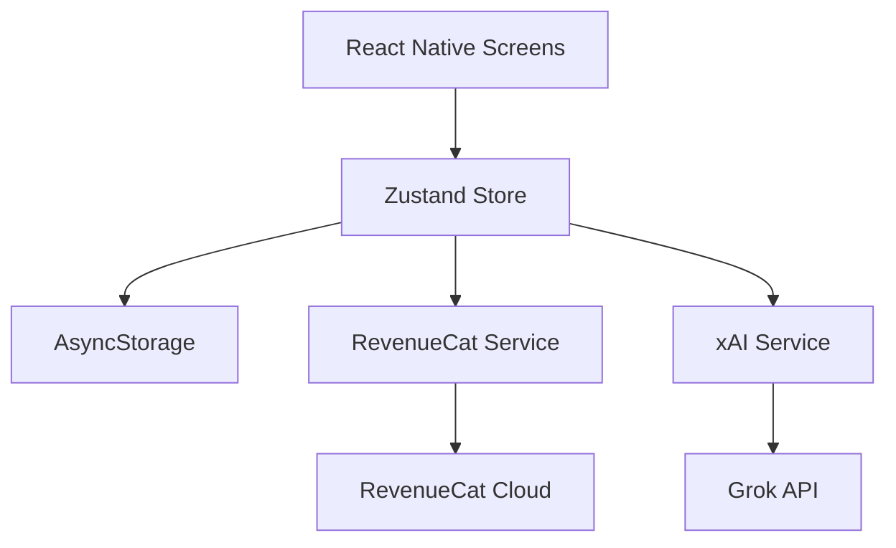

# Technical Architecture: FocusForge AI

## Architecture Overview
FocusForge AI follows a clean, modular architecture centered around a central Zustand store that synchronizes the UI with both the AI service and local persistence.

## Critical Components

### 1. State Hub (`useStore.ts`)
The heartbeat of the app. It manages:
- **Daily Loop Persistence**: Automatically resets tasks and counters at midnight.
- **Streak Calculation**: Increments only if a task is completed on consecutive days.
- **Auth/Sub State**: Real-time entitlement checks via RevenueCat.

### 2. AI Execution Engine (`xai.ts`)
- **JSON Mode**: Uses `response_format: { type: 'json_object' }` to ensure structured task output.
- **Usage Guardrails**: Implements basic caching and token capping to control API costs.
- **Fail-Safe**: Hardcoded fallback tasks ensure the app is usable even during API outages.

### 3. Monetization Layer (`revenuecat.ts`)
- Implements the `premium_access` entitlement.
- Entitlement checks happen on app mount and during restricted actions (e.g., viewing weekly summaries).

## Resource Optimization
- **8GB Safe**: Lightweight state management (Zustand) and minimal dependency footprint.
- **Minimal Junk**: No heavy analytics libraries or excessive background assets.
